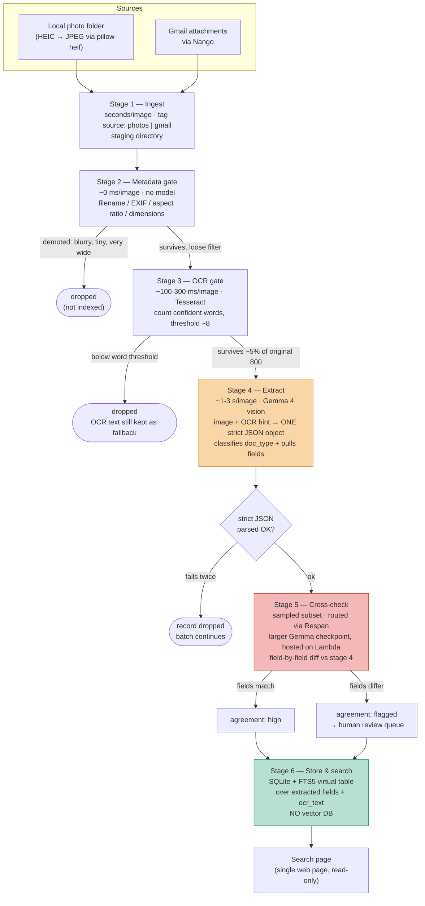
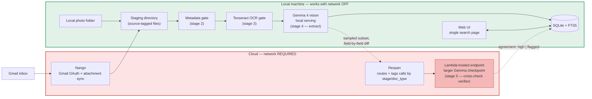

# Retrace — System Architecture

Two views of the same system: the **pipeline** (how a file becomes a searchable record) and the **components** (what runs where, and which side of the network boundary it's on). See [`CLAUDE.md`](./CLAUDE.md) for the full spec, data model, and judging rubric.

---

## 1. Pipeline — the six-stage cascade

The funnel is the point: a vision model over a few thousand images is too slow for one day, so stages 2–3 exist purely to keep volume off stage 4. Roughly 800 candidates should narrow to ~5% (~40 images) by the time they reach extraction.

**Reading the colors:** orange (stage 4) and red (stage 5) are the only stages that touch a model — everything before them is free/cheap filtering, and everything after them is instant local storage.

---

## 2. Components & network boundary

This is the diagram that makes the demo-day constraint concrete: **everything must run with the network off except the Nango sync and the Respan-routed Lambda call for stage 5.** Pre-index before demos so this boundary is never tested live.

**Rubric mapping onto this diagram:**

| Rubric line | Component |
|---|---|
| Nango API use | `Gmail inbox → Nango → staging directory` |
| Lambda — host an open model | `Lambda-hosted endpoint` (must be the Gemma checkpoint used in stage 5) |
| Respan use | `Respan` node — routes/tags both the stage-4 and stage-5 model calls |
| Multi-agent coordination | `Gemma 4 vision (stage 4)` vs. `Lambda Gemma checkpoint (stage 5)` agreement diff, flagged records → review queue |
| Bonus — Gemma on Lambda | Satisfied automatically if `LAMBDA` node is a Gemma checkpoint |

---

## Open items that affect these diagrams

The **Runtime & serving** and **Application shape** questions in `CLAUDE.md` (local serving stack choice, backend framework, background-worker vs. CLI indexing) will refine box-level detail here but not the overall shape — the source → gates → extract → cross-check → store funnel and the local/cloud network split are fixed by the scope contract and should not change once implementation starts.
