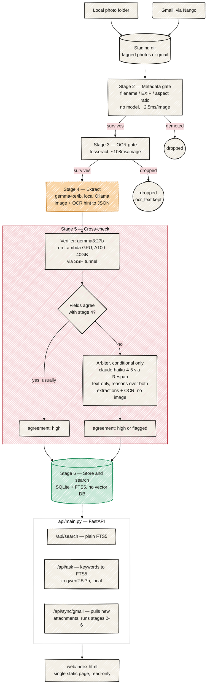

# retrace

Everyone's documents are scattered across a camera roll and an inbox, and none of them are searchable. Retrace reads all of it locally, pulls out the structured content, and makes it queryable, with a second model checking the first one's work.

Built for the Open Model Hack (2 people, 10:30–16:30, judged live).

## System design (as built)

`ARCHITECTURE.md` is the original pre-build plan — stage 5 evolved once Lambda/Respan keys
actually arrived (see `CHECKPOINT2.md` for the full story). This is what's actually running.



<!-- ASCII fallback, in case mermaid doesn't render in your viewer (GitHub renders it natively;
some editor previews don't):
  Local photo folder ────┐
                          ├──▶  staging dir (tagged photos | gmail)
  Gmail, via Nango ───────┘            │
                                        ▼
                        ┌───────────────────────────────┐
                        │ Stage 2 — Metadata gate        │
                        │ filename / EXIF / aspect ratio  │
                        │ no model · ~2.5 ms/image        │
                        └───────────────────────────────┘
                              │ survives        │ demoted
                              ▼                 ▼
                 ┌───────────────────────┐   [ dropped ]
                 │ Stage 3 — OCR gate     │
                 │ tesseract · ~108ms/img │
                 └───────────────────────┘
                     │ survives      │ dropped
                     ▼               ▼
       ┌─────────────────────────┐  [ dropped, ocr_text kept ]
       │ Stage 4 — Extract        │
       │ gemma4:e4b, local Ollama │
       │ image + OCR hint → JSON  │
       └─────────────────────────┘
                     │
                     ▼
  ┌──────────────────────────────────────────────────────────────┐
  │ Stage 5 — Cross-check                                         │
  │  Verifier: gemma3:27b on a Lambda GPU instance (A100 40GB),    │
  │  reached over an SSH tunnel — re-reads the image blind to      │
  │  stage 4's answer.                                             │
  │  Fields agree with stage 4? ──yes (usually)──▶ agreement: high │
  │  no ──▶ Arbiter (conditional only): claude-haiku-4-5 via       │
  │  Respan, text-only — reasons over both extractions + OCR       │
  │  text, no image. Decides a resolution, or escalates.           │
  │  agreement: high (resolved) or flagged (needs human review)    │
  └──────────────────────────────────────────────────────────────┘
                     │
                     ▼
       ┌─────────────────────────┐
       │ Stage 6 — Store & search │
       │ SQLite + FTS5, no vector │
       │ DB, no embeddings        │
       └─────────────────────────┘
                     │
                     ▼
       api/main.py (FastAPI): /api/search, /api/ask, /api/sync/gmail
                     │
                     ▼
              web/index.html (single static page, read-only)
-->

**Why cross-check is structured this way, not three models voting in parallel:** two
independent models reading a clear document should usually agree — running a third
model unconditionally just to triple-check agreement wastes a call most of the time
and doesn't add a distinct capability. The arbiter is dispatched only on genuine
disagreement, and its job is categorically different from the other two: it never
sees the image, it reasons over two conflicting JSON extractions and the OCR text and
either resolves the conflict or escalates it — a router calling in a specialist, not
three votes on the same question.

**Network boundary:** three things need network — the Gmail sync (Nango), the stage-5
verifier (SSH tunnel to the Lambda GPU instance), and the conditional stage-5 arbiter
(Respan). Everything else — the gates, stage 4's local Ollama call, storage, search,
and ask — runs fully offline against the local SQLite file. Sync and index before
going offline; search and ask need no network afterward.

## Setup

Dependencies and the Python version are managed with [`uv`](https://docs.astral.sh/uv/) — no manual `venv`/`pip` steps.

1. Install `uv` if you don't have it: `curl -LsSf https://astral.sh/uv/install.sh | sh` (or `brew install uv`)
2. Clone the repo, then from its root:
   ```bash
   uv sync
   ```
   This creates `.venv/`, installs the exact pinned versions from `uv.lock`, and installs the Python version pinned in `.python-version` (3.12) if you don't already have it.
3. Copy the secrets template and fill in your own keys — never commit `.env`:
   ```bash
   cp .env.example .env
   ```
   `.env` holds Nango, Respan, and Lambda credentials plus local paths (photo folder, DB path, Ollama host/model). A `.claude/` hook blocks direct edits/commits of `.env` from inside Claude Code — edit it by hand.
4. Generate the fifteen synthetic needle-test documents — these are **not** committed (generated,
   not source), so this step is required after every fresh clone:
   ```bash
   uv run python tests/needles/generate_needles.py
   ```
   Re-run any time to regenerate deterministically; see `tests/needles/manifest.json` for the
   expected outcome of each one and `.claude/skills/needle-test` for the check that uses them.
5. External runtime dependencies (not managed by `uv`): [Tesseract OCR](https://github.com/tesseract-ocr/tesseract) (`brew install tesseract`) for stage 3, and [Ollama](https://ollama.com) for the local stage-4 vision model.

Adding a dependency later: `uv add <package>` (or `uv add --group dev <package>` for dev-only tools) — this updates both `pyproject.toml` and `uv.lock` together, so always commit both.

## Docs

- [`CLAUDE.md`](./CLAUDE.md) — full scope contract, the six-stage extraction cascade, data model, judging rubric, and the open setup questions still to be resolved
- [`ARCHITECTURE.md`](./ARCHITECTURE.md) — mermaid diagrams: the pipeline funnel and the local/cloud component + network boundary
- [`plan.md`](./plan.md) — step-by-step build plan, Phase 0 (keys/environment) through Phase 11 (demo prep), including the default resolutions assumed for each open question

## Project-local automation

`.claude/` in this repo adds a few things scoped to this build:
- `skills/needle-test`, `skills/pipeline-throughput` — re-runnable checks described in `plan.md`
- `agents/schema-guard`, `agents/respan-call-auditor` — reviewers for the null-over-guess data rule and the Respan call-tagging rubric line
- `settings.json` hooks — block direct edits to `.env`, and block `git add`/`git commit` from staging `.env` or the local image staging directory
